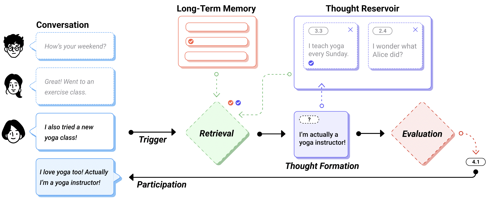

# Proactive Agents with Inner Thoughts 💭

A framework for modeling agent thoughts and conversations, enabling more natural and human-like interactions between AI agents and humans.

## Overview

Thoughtful Agents provides a structured approach to modeling the internal thought processes of AI agents during conversations. Rather than simply predicting conversational turns, this framework enables proactive AI driven by its own internal "thoughts".

This framework is based on the paper [Proactive Conversational Agents with Inner Thoughts](https://arxiv.org/pdf/2501.00383), published at [CHI 2025](https://doi.org/10.1145/3706598.3713760).



Inspired by cognitive architectures and LLM prompting techniques, the framework comprises five stages:
1. **Trigger** - Initiating the thought process
2. **Retrieval** - Accessing relevant memories and context
3. **Thought Formation** - Generating potential thoughts
4. **Evaluation** - Assessing intrinsic motivation to express thoughts
5. **Participation** - Deciding when and how to engage in conversation

The Python implementation includes:
- Thinking engine for thought generation and evaluation
- System 1 (fast, automatic) and System 2 (slow, deliberate) thinking
- Mental object management (thoughts, memories)
- Saliency-based memory and thought retrieval
- Conversation and event tracking
- Turn-taking prediction and engine for determining when and who should speak next
- Proactivity configuration for agents

## Research Background

Most current LLM-based systems treat AI as passive respondents, responding only to explicit human prompts. The Inner Thoughts framework takes an alternative approach inspired by human cognition, where we process others' words, reflect on our experiences, and develop an internal train of thoughts before deciding to participate.

This approach models the distinction between *covert responses* (internal thoughts and feelings) and *overt responses* (verbal utterances) in human communication. The AI participant determines whether to engage based on an evaluation of its intrinsic motivation to express a particular thought at that moment.

## Installation

1. Install the package and its dependencies:

```bash
pip install -e .
```

2. Download the required spaCy model:

```bash
python scripts/download_spacy_model.py
```

Or manually:

```bash
python -m spacy download en_core_web_sm
```

3. Set up your OpenAI API key:

```bash
export OPENAI_API_KEY=your_api_key_here
```

## Project Structure

The project is organized as follows:

- `inner_thoughts_ai/models/`: Core model classes
  - `participant.py`: Participant, Human, and Agent classes
  - `thought.py`: Thought-related classes
  - `memory.py`: Memory-related classes
  - `conversation.py`: Conversation and Event classes
  - `mental_object.py`: Base class for mental objects
  - `enums.py`: Enumeration types
- `inner_thoughts_ai/utils/`: Utility functions
  - `llm_api.py`: OpenAI API interaction
  - `saliency.py`: Saliency computation
  - `thinking_engine.py`: Functions for thought generation, evaluation, and articulation
  - `turn_taking_engine.py`: Turn-taking prediction 
  - `text_splitter.py`: Text splitting using spaCy

## Key Components

### Participants

The framework models different types of conversation participants:
- `Participant`: Base class for all conversation participants
- `Human`: Represents human participants in the conversation
- `Agent`: AI agents that can generate thoughts, evaluate them, and decide when to participate

### Thoughts and Memory

Both `Thought` and `Memory` are subclasses of `MentalObject`.
The framework distinguishes between:
- `Thought`: Temporary mental objects representing current thinking
- `Memory`: Longer-term mental objects stored for future retrieval

They are managed through the `ThoughtReservoir` and `MemoryStore` classes respectively.

### Conversation and Events

The `Conversation` class manages the overall conversation state, while `Event` objects represent individual utterances or any other actions within the conversation.

### Mental Objects

The `MentalObject` class serves as the base for all mental entities in the system. It includes attributes like content, embedding, saliency, and weight that determine how important and relevant the object is in a given context.

### Thinking Engine

The thinking engine is responsible for:
- Generating System 1 (fast, intuitive) thoughts
- Generating System 2 (slow, deliberate) thoughts
- Evaluating thoughts for their intrinsic motivation
- Articulating selected thoughts as utterances

### Turn-Taking

The turn-taking engine predicts appropriate moments for participation and decides which agent should speak next based on their intrinsic motivation scores.

### Proactivity Configuration

Inner Thoughts offers fine-grained control over AI conversation participation through three proactivity layers:

1. **Overt Proactivity**: Controls conversation engagement tendency via the `system1Prob` parameter (0-1).

2. **Covert Proactivity**: Sets motivation threshold for expression using the `imThreshold` parameter (1-5).

3. **Tonal Proactivity**: Adjusts language assertiveness with the `proactiveTone` parameter (true/false).

The framework also supports **interruption** through the `interruptThreshold` parameter (1-5), allowing AIs to override turn allocation when highly motivated.

To determine when and how the AI participates:
- For open turns: AI speaks if motivation exceeds threshold
- For allocated turns: AI uses highest-rated thought
- For others' turns: AI interrupts only with sufficient motivation


## Usage Example

*Work in progress.* 🚧

## License

This project is licensed under the Apache 2.0 License - see the LICENSE file for details.

## Citation

If you use this framework in your research, please cite:

```
@inproceedings{liu2025inner,
    title={Proactive Conversational Agents with Inner Thoughts},
    author={Liu, Xingyu Bruce and Fang, Shitao and Shi, Weiyan and Wu, Chien-Sheng and Igarashi, Takeo and Chen, Xiang Anthony},
    booktitle = {Proceedings of the 2025 CHI Conference on Human Factors in Computing Systems},
    year = {2025},
    publisher = {Association for Computing Machinery},
    address = {New York, NY, USA},
    location = {Yokohama, Japan},
    series = {CHI '25},
    keywords = {Full},    
    url = {https://doi.org/10.1145/3706598.3713760},
    doi = {10.1145/3706598.3713760},
}
```

## Contact

For questions or feedback, please feel free to reach out to [Xingyu Bruce Liu](https://liubruce.me/)!
